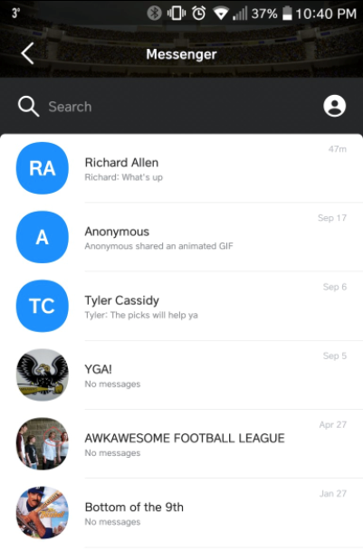
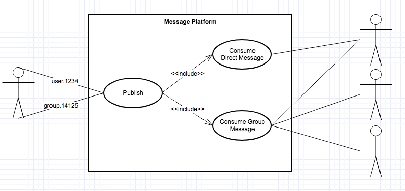
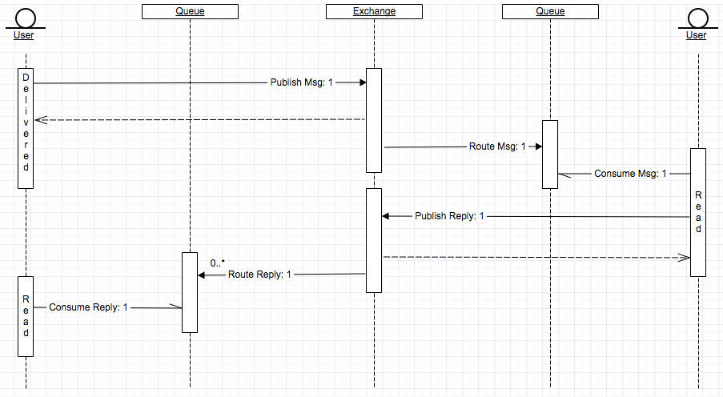

I had applied for a software developer role at [Indellient](https://www.indellient.com/), when I was invited in for an interview it was actually for two roles: Developer and Business Analyst. As part of the interview I was asked to write a design/analysis document about one of my "favorite/most used" pieces of software.

It took me a while to decide what I wanted to write about; the whole question of "my favorite application" kind of threw me. My most used application is definitely Yahoo Fantasy Sports, but I wasn't particularly sure how it would go over in an interview. I bit the bullet and just provided this write-up anyhow. In the end I was offered both positions, the BA at a higher salary and a Junior Developer role. At that time I really wanted to switch from BA/Support into development but the salary was just too low for me at the time (family and all) - which in retrospect I really regret, as soon after my wife received a couple promotions it would have been perfectly fine!

> I don't regret where I am now in the least, but I can still say that it would have been cool if I knew how things would play out and had taken that role.

All in all this isn't (and never was) the best document, but it met the criteria and provided a good discussion for the Indellient managers.

# Analysis of Yahoo Fantasy Chat/Notifications

Yahoo and other applications (like WhatsApp) use RabbitMQ for their messaging platform. Using RabbitMQ or another platform (such as ActiveMQ) provides the following functionality across an application suite:

- Instant messaging
- Remote Procedure Calls (RPC)
- Client/server communication
- Notifications
- Etc.

## Trade Discussions and Trash Talking

Yahoo provides instant messaging and group chat functionality to all league members for the purpose of trade discussions or trash talking. The publishing and consuming concept of message broker applications makes implementing a chat program easy, as it supports a wide range of messaging types:

- One to one
- Group chat
- Etc.

The publish and consuming functionality provided by the messaging platform can be seen on the next page (Fig 1). In this example, I want to send two messages, one to the person I’m playing this week (off topic - I won) and the other to group of managers in the league.

## Publishing

A message is published to an exchange, the exchange is like a mail box, it’s responsible for accepting all messages. It’s like a mail box sitting on the side of the road, it just waits for someone to walk by and drop a message in it. The exchange is configured with bindings; the combination of a routing key to a queue. In the example below I sent two messages:

1. The first to user 1234 using the routing key user.1234 Using this format, I can send a message to any user, as long as I know their routing key value (1234).
2. The second is to a group of managers using the group.14125 routing key. In this case 14125 is the group id, which all users in the group will know about.

Once the message is delivered, a receipt is provided stating that the message has been delivered appropriately.

## Consuming

The routing key/binding links an exchange to a queue. A queue represents a mailbox that is accessible by either a single user (queue exclusivity) or a group of users. Rich receives both messages because his phone is consuming from both queues (his user and the league manager queues).

## Extended Features

Both RabbitMQ and ActiveMQ can be used with other features to provide extended functionality in the case of Yahoo fantasy sports and trash talking.

### Live Updates and Notifications

Fantasy sports, like real sports, rely heavily on a stream of information coming in from the servers. Specifically, while watching a football game on television players are continually gaining statistics, these statistics are being updated on Yahoo servers, which are then updated directly on a user’s device. This takes advantage of queues being allowed to have multiple routing keys, for example while I’m watching a football game, my queue is being updated with messages for:

- To:user.42535 Type: Message
- Re:player.football.1234 Type: StatUpdate

The Yahoo app running on my phone will get Messages (which could be trash talk back from Rich) as well as StatUpdates (which could be touch down notifications). The application is now responsible for managing how it uses each of these message types.

### Message Confirmation

Trash talking is only useful when you are sure the other person has seen it. BBM and WhatsApp implemented receipt functionality in their apps by showing different icons next to your messages:

- One grey check for delivered
- One blue check for read
- Multiple grey checks for delivered to group
- Multiple blue checks for read by entire group

This is implemented by using the message platform as an RPC server. The requirement for this, is that each message contains a reply to key (so that we can be certain the consumer knows where the reply should go) and a message id (called a correlation id on RabbitMQ). When the reply message comes back referencing the same correlation id as my initial trash talk message, I know that it’s been read.
