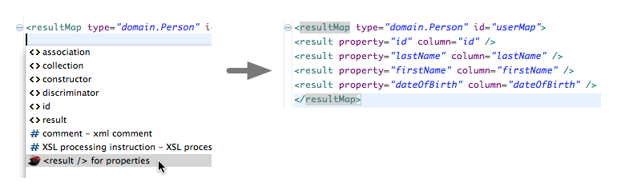

[My Batipse](https://github.com/mybatis/mybatipse) is a great Eclipse plugin that provides:
Validation
Generation
Tools
while working with Mybatis XML files.   When I started at [Standardbred Canada](https://www.standardbredcanada.org) the DB library of choice was Mybatis (which I'd never used before) but quickly started to love it.  

> The primary reason that MyBatis was chosen due to it's ability to map legacy tables to updated domain models with ease.  In order to quickly replicate the legacy functionality, the ability to write XML based SQL was a requirement.

The primary feature that I started using was **Result Map generation** option.



## Review of MyBatipse Feature

The functionality was pretty basic, it would reflectively inspect the domain model fields, and create the result mapping for this item.   One of the major problems was, that this did a direct mapping of name to column, which in our case (and most cases) wasn't generally the case.  For example, if the object I was attempting to query was:

```java
public class Address {
    private String address1;
    private String address2;
    ...
}
```

with the matching result map:

```xml
<resultMap>
   <result property="address1" column="address1"/>
   <result property="address2" column="address2"/>
   ...
</resulMap>
```

the issue is that our tables are defined a little differently:

```sql
select ad_addr1, add_addr2, ... from address
```

the `resultMap` still required a bunch of manual edits.  I could choose to either update the SQL to include aliases matching the Java `Address` but that would get hectic when working with collections and associations.   

## JPA Annotations

I figured it would be easier to add JPA annotations to my domain models, as this would provide:
the ability to maybe switch away from MyBatis down the road
in source documentation for easy lookup (until this point columns were "documented" by appending `private String address; // ad_addr1` 🙁
Plus it would give me a chance to take a look at how and what MyBatipse was doing - and learning something new is never bad.   This is still a work in progress, it's crude and I want to make it better before submitting a pull request [https://github.com/kenjdavidson/mybatipse/tree/jpa-mapping](https://github.com/kenjdavidson/mybatipse/tree/jpa-mapping).

When installing and using this version of MyBatipse you have the following available:

```java
@Entity 
@Table(name="address")
public class Address {
    @Id
    @Column(name="ad_id")
    private long id;

    @Column(name="ad_addr1")
    private String address1;

    @Column(name="ad_addr2") 
    private String address2;

    ....
}
```

which would be extracted to:

```xml
<resultMap>
   <id property="id" column="ad_id"/>
   <result property="address1" column="ad_addr1"/>
   <result property="address2" column="ad_addr2"/>
   ...
</resulMap>
```

As we can see, the resultMap is now updated with the appropriate column names.  No more editing of resultMaps (at least for simple maps that is).

#### Collections and Associations

There's still work that needs to be done in order to get Collections and Associations working properly.   On a basic level they work well - but to allow for some best practices I've noticed - we need to provide **aliases** and **prefixes** to the result map entries.

## SQL Statement Column Generation

Another added feature was the ability to create `<sql>` blocks containing the columns for INSERT, UPDATE and SELECT statements.   The following menu features are available when working with a `<resultMap>`:
`Source > ResultMap SQL > Select columns`
`Source > ResultMap SQL > Insert columns`
`Source > ResultMap SQL > Update columns`
which will create the appropriate SQL blocks (respectively):

```xml
<sql id="addressMapSelectColumns>
    ad_addr1, 
    ad_addr2,
    ...
</sql>
```

```xml
<sql id="addressMapInsertColumns>
    (ad_addr1, 
    ad_addr2,
    ...)
    values (#{address1},
    #{address2},
    ...
    )
</sql>
```

```xml
<sql id="addressMapUpdateColumns>
    ad_addr1 = #{address1}, 
    ad_addr2 = #{address2},
    ...
</sql>
```

which can easily be used:

```xml
<select id="selectAddress">
    select <include ref="addressMapSelectColumns" />
    from address
</select>
```

```xml
<insert id="insertAddress" parameterType="Address">
    insert into address 
    <include ref="addressMapInsertColumns" />
</insert>
```

```xml
<insert id="updateAddress" parameterType="Address">
    update address 
    set <include ref="addressMapUpdateColumns" />
    where ...
</insert>
```

## Roadmap items

I'm currently using this in my day-to-day, but there are some things that need to get added/update:

### Handling Class Extension with Prefixes

For example, right now base classes are not handled well.   This probably won't affect many, but in our case our child objects contain prefixed column names in legacy, meaning that automating the `resultMap` still requires some manual intervention to update the column names coming from the parent object.

```java
public class Parent {
    @Column(name="col1") 
    private String column1
}

public class Child extends parent {
    @Column(name="c_col2")
    private String column2;
} 
```

this will result in Child result map:

```xml
<resultMap type="Child">
    <result property="column1" column="col1"/>
    <result property="column2" column="c_col2"/>
</resultMap>
```

where we actually want

```xml
<resultMap type="Child">
    <result property="column1" column="c_col1"/>
    <result property="column2" column="c_col2"/>
</resultMap>
```

### Collection and Association Mapping

This is pretty crude at the moment.  It would be good if it could support:
Aliases
Prefixes
Etc.