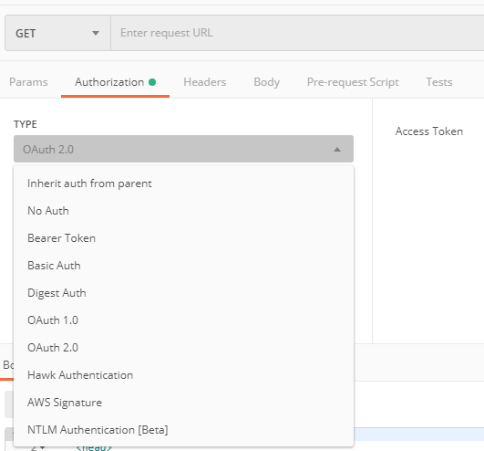
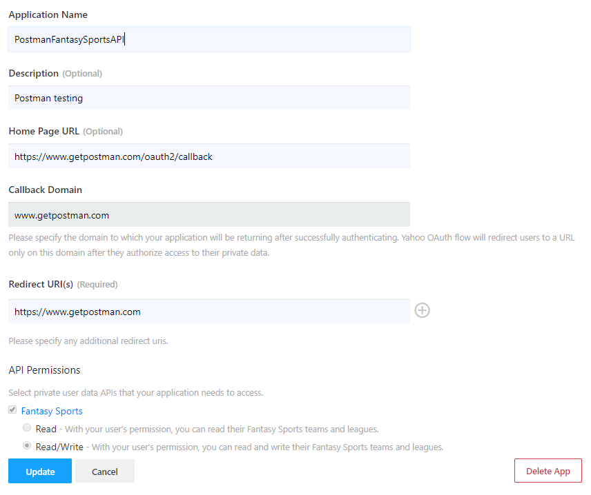
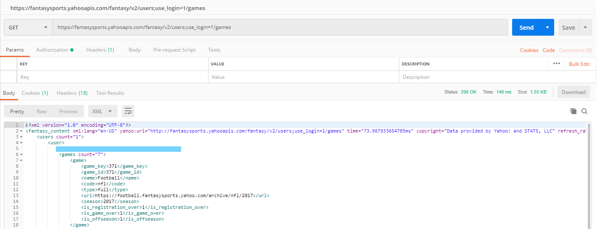
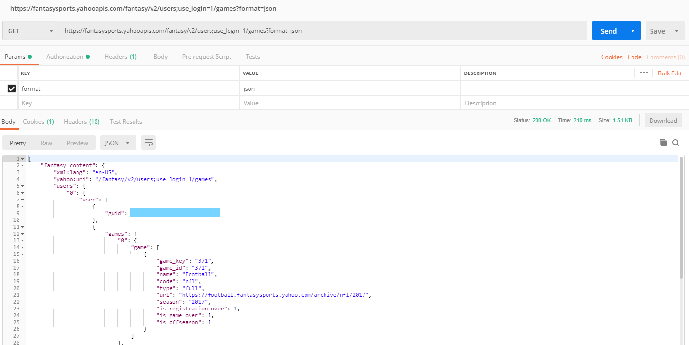

I love playing around with the Yahoo Fantasy Sports APIs.   In the past I wrote the a [PHP library](https://github.com/kenjdavidson/php-oauth-yahoofantasysports) and [Wordpress plugin](https://github.com/kenjdavidson/yahoo-fantasy-wordpress) which worked wonders, but I recently wanted to start on an updated library (Java/Javascript I haven't decided) in order to provide myself with some added features that I've been wanting for a while.   The first step was getting back to understanding the APIs, it'd been a few years since the PHP library and I wanted to just test out a few things - the PHP code was hacky as not my native language - so that I could improve upon the old library.

## Postman

[Postman](https://www.postman.com/) is an amazingly designed (what used to be a simple app) platform for managing your APIs.   Essentially every developer/team (in my opinion) should have Postman installed. 

#### OAuth2 in Postman

Postman provides, pretty much, every authentication feature available for accessing APIs - the most common one these days is OAuth2.   When configuring your API, you can select the `Authorization` tab and look for the appropriate method in the **Type** dropdown.  If you've never used OAuth2 before - there are a number of external articles that should definitely be read:

https://en.wikipedia.org/wiki/OAuth
http://www.bubblecode.net/en/2016/01/22/understanding-oauth2/
https://developer.yahoo.com/oauth/



To make life easier, Postman provides internal generation and management of your OAuth2 tokens.  

## Yahoo OAuth

All (or most of) Yahoo's APIs are secure behind their OAuth2 authorization server, what this means is that in order to start making requests you'll need to complete two steps:

#### Creating an Yahoo (OAuth2) App

Yahoo needs to know about the app with which you're about to start communicating to their servers.   All users accessing their yahoo data will be using the CLIENT_ID and CLIENT_SECRET provided to this specific app, using this apps configuration.   Because each app requires it's own configuration, this means you'll need to create your own Postman configuration to perform testing.

###### Login to the Yahoo Developer network.

https://developer.yahoo.com/

###### Create a new application with the following settings

The important keys here are **Callback Domain**, **Redirect URI(s)** and **Scope** as you will need to replicate these exactly in your OAuth2 client request.
     
Note that I've already saved my App, but the Fantasy Sports Read/Write scope is **fspt-w**.

#### Generating your Yahoo OAuth2 token

Once you application is created you will be provided a **Client Id** and **Client Secret**, these will be available to you from the Yahoo developer portal.  It should be pretty obvious, keep your **secret a secret**.

Open up Postman and and on a new request tab click **Generate New Access Token** which should prompt you with the following (or something similar).  Again notice the specific entries that must match the entered values within your Yahoo App. 



###### Refreshing your token

There is no built in functionality to refresh your token, but you can rerun **Get New Access Token** using the same configuration and you'll be good.

## Making API Requests to Yahoo Fantasy Sports

The simplest request to make and test your connection is the `Users Resource with Games sub-resource` using the logged in user.

```
https://fantasysports.yahooapis.com/fantasy/v2/users;use_login=1/games
```

Should result in an XML listing of your game history.



To get JSON back, you can add the parameter **format=json**.  Just remember that XML to JSON conversion will add numeric keys to each item in your collection array.


 
Enjoy adding your Yahoo Fantasy Sports details to your blog, app, etc.