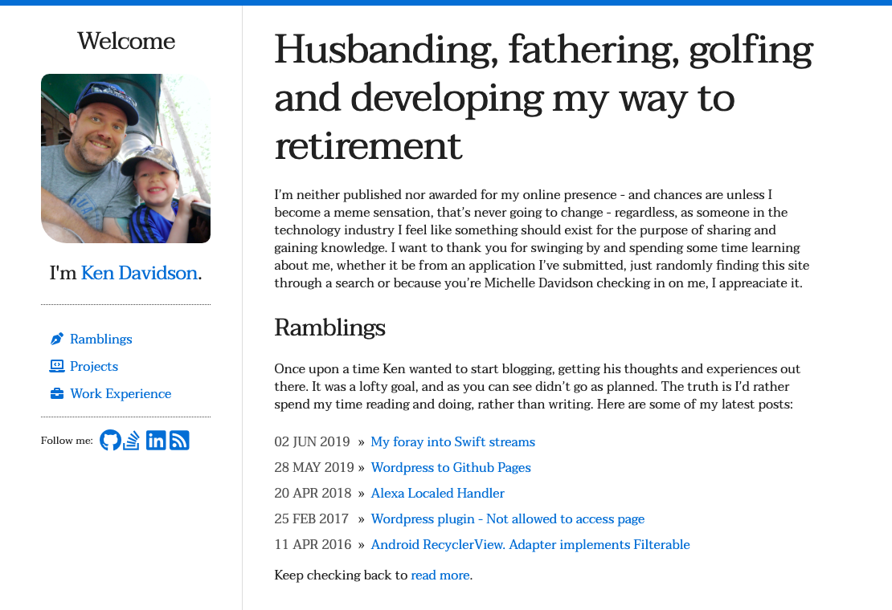
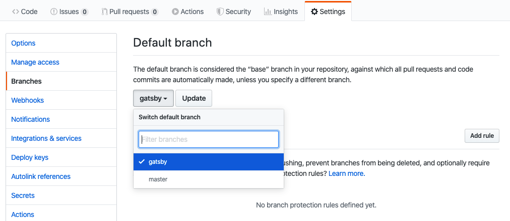

A few months ago I decided that I was going to cancel my hosting with <a href="https://www.godaddy.com">Go Daddy</a> in an attempt to save on some expenses. I've been a Github member for a while now, although I hadn't started using it to it's (near full) potential until a few years back. While looking for alternatives I came across <a href="https://pages.github.com/">Github Pages</a> which had the two major benefits of being <strong>free</strong> and <strong>documented</strong>.

## Jekyll

So, after some more looking around and reading it turned out that <a href="https://jekyllrb.com/">Jekyll</a> was the "primary" method for publishing sites to Github Pages.

> Jekyll is a static site generator. You give it text written in your favorite markup language and it uses layouts to create a static website. You can tweak how you want the site URLs to look, what data gets displayed on the site, and more.

For styling of the site you have a large number of themes available - it felt like the first place to start was to find a theme that I enjoyed and start modifying from there... enter <a href="">Lagom</a> by Matt Swanson. A nice simple theme providing me the ability to start converting my Wordpress posts to markdown (quickly, at this point I had read about Gatsby but figured this was a simple enough start. I had only played around with React a bit and wasn't ready to commit).

After a couple days of playing around I had modified Lagom enough to warrant renaming to <a href="https://kenjdavidson.github.io/lagomier">Lagomier</a>:



This worked well for the basic pages that I had going:

- Home
- About
- Resume

Things become a little tricky when I start looking at the other functionality that I had available:

- Yahoo! Fantasy Scoreboards and Standings
- Golf profile and recent round scores

With Jekyll these were still doable, but would require some changes:

1. Re-build the client side functionality to dynamically pull content, this is an issue due to OAuth requiring access/refresh tokens - so essentially not doable.
2. Learn Ruby to make interfacing and customizing Jekyll and build the static pages behind the scenes. I'm not the biggest fan of learning Ruby, so this is going to also be out.
3. Just migrate to Gatsby and do a little more work (upfront, which would be fun anyhow) and get what I actually want with built in functionality.

## Gatsby (why didn't I choose you first?)

At this point I had already gotten some experience with React (through React Native) while designing and developing my companies microchip scanning app Standardbred Mobile <a href="https://play.google.com/store/apps/details?id=com.standardbredmobileapp&hl=en_CA">Google</a>/<a href="https://apps.apple.com/ca/app/standardbred-canada-mobile/id1476739891">IOS</a>. As the comment says, I really wish I had committed to Gatsby/React prior to Jekyll, as the more I've read and played with it I definitely prefer it to a number of other Javascript frameworks that I've played with.

Much like the process with Jekyll, it was pretty much a no brainer to just start looking around to see if there was an already created theme that I enjoyed. As you can probably tell I'm not the most artistic person, and I really am not a fan of photography/photograms so besides what I steal from my wife's Instagram there won't be much around. I figured it would be pretty straight forward to start creating a theme from scratch, which wasn't that terrible.

### Layout and Required Pages

First thing first I needed to decide upon the layout - this was pretty simple - I already liked my simplistic Wordpress theme and figured it would be straight forward converting it to Gatsby. Sadly I don't have a screenshot of the old site (at this point) but at a high level:

- Pages contain a Header/Navbar which provides access to the menu (it may be a light menu, but I've got lofty goals).
- Home page contains blog summary, project summary, etc.
- Blog pages (posts in wordpress)
- Resume page built from sub-resources (pages in Wordpress)
- Yahoo! Fantasy pages
- Golf profile/score pages

### Relating Requirements to Gatsby

[TODO]

### Converting from Jekyll to Gatsby

The conversion from Jekyll to Gatsby was pretty painless. The build process is just as straight forward and the ability to consume markdown files provides a lot more customization that Jekyll had. The one thing that is lacking though, or at least that I relied heavily on during my writing was the `{:.className #idValue}` macro that was available; for example:

```markdown
{: .header-link}

## Header with ClassName

{: .error}

> This is an error blockquote

{: .table.table-condensed}
| bootstrap | table |
| --- | --- |
| missing | styles |
```

Which I had previously used throughout my pages and posts. The only saving grace, is that I think I'll be able to take the opportunity to write my own `gatsby-transformer-remark` plugin to do so.

## Publishing Gatsby to kenjdavidson.github.io

One of the things that threw me for a loop was deployment, which is sad since it's pretty well documented. One of the keys is that Github Pages requires that your `[username].github.io` site is based off the `master` branch. This works great with Jekyll but for Gatsby you need the site to be at the root level. To get this working I did the following:

### Create a Gatsby branch for development

I decided that I would make the primary branch of the repository `gatsby`, this is where all my changes / pull requests would be merged. This would also allow me to publish the static files to `master` without any conflict or extra files.

- Open up Github > [Project] > Settings
- Branches
- Change `Default Branch` to **gatsby**



> Make sure that you update your `edit url` if you're linking back to your source files on your blog/article template(s).

### Follow the gh-pages Documentation

I read the documentation [https://www.gatsbyjs.org/docs/how-gatsby-works-with-github-pages/#deploying-to-a-github-pages-subdomain-at-githubio](https://www.gatsbyjs.org/docs/how-gatsby-works-with-github-pages/#deploying-to-a-github-pages-subdomain-at-githubio) but I obviously didn't read it that well! I missed the `master` part.

Once my master branch was free to overwrite, I added the appropriate script:

```json
"scripts": {
  "deploy": "gatsby clean && gatsby build && gh-pages -d public -b master"
}
```

Then a quick little:

```bash
$ npm run deploy
```

and the site is published.

## On the Docket

Just a quick rundown of some tasks that need to get done:

- ~~Release the new site to <a href="https://www.kenjdavidson.com">kenjdavidson.com</a>~~
- ~~Update with <a href="https://www.gatsbyjs.org/docs/seo/">SEO</a> and <a hre="https://www.gatsbyjs.org/docs/add-page-metadata/#using-react-helmet-and-gatsby-plugin-react-helmet">Helmet</a> plugins.~~
- Create the Golf Canada source and transformer plugin to get my Golf info online
- Convert the <a href="https://github.com/kenjdavidson/yahoo-fantasy-wordpress">Yahoo Wordpress</a> plugin to Gatsby
- Get Dark/Light/Color themes working
