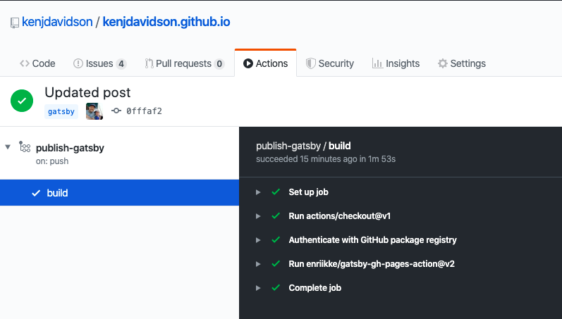
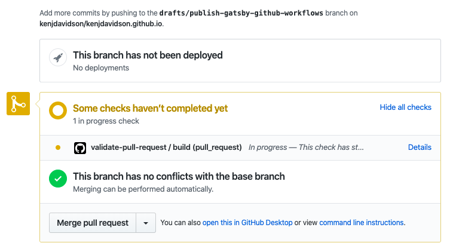

Now that I've got things rolling with my [Gatsby conversion](/writing/2020/03/01/here-comes-gatsby) and everything seems good working with Github Pages, it was time to automate the build/release process. What a great chance to start playing with a little Github Actions (Yup, I know this stuff is old - but it's still new to me!). Right off the bat, my two priorties are to:

1. Automate the build when publishing new content to the `gatsby` branch
2. Perform a test build of any pull requests that come in.

With these two things, I have the ability to make modifications on the fly directly from Github as well as start following a few best practices for new content. Enter:

### Github Workflows

[Github Workflows](https://help.github.com/en/actions/configuring-and-managing-workflows/configuring-and-managing-workflow-files-and-runs) provide the ability to configure any number of jobs, performed as reactions to common Gitub and API actions.

### Gatbsy GH Pages Action

While Googling around I found this little gem of a project, [Gatsby Publish action](https://github.com/marketplace/actions/gatsby-publish) that did exactly what I was looking for; with regards to publishing the `gatsby` branch to `master` on push. With a couple [changes](https://github.com/enriikke/gatsby-gh-pages-action/pull/16) it's possible to perform only a build, by `skip-publish`ing the job.

## Github Workflow Config

The first step to setting up workflows is to create a configuration file, from your project page:

- click on `Actions`
- then `New Workflow`.

### publish-gatsby.yml

```yml
# Publish Gatsby
name: publish-gatsby

# Controls when the action will run. Triggers the workflow on push or pull request
# events but only for the master branch
on:
  push:
    branches:
      - gatsby

# A workflow run is made up of one or more jobs that can run sequentially or in parallel
jobs:
  # This workflow contains a single job called "build"
  build:
    # The type of runner on which this job will run
    runs-on: ubuntu-latest

    # Steps represent a sequence of tasks that will be executed as part of the job
    # - Checkout gatsby branch
    # - Update authentication for Github Package Registry @kenjdavidson/base16-scss
    # - Build gh-pages using action
    steps:
      - uses: actions/checkout@v1
      - name: Authenticate with GitHub package registry
        run: echo "//npm.pkg.github.com/:_authToken=${{ secrets.ACCESS_TOKEN }}" > ~/.npmrc
      - uses: enriikke/gatsby-gh-pages-action@v2
        with:
          access-token: ${{ secrets.ACCESS_TOKEN }}
```

At a high level this file is:

- Kicking the workflow off on Push and Pull of the `gatsby` branch, which is configured as my main branch
- Checks out the branch
- Applies any custom logic (see below)
- Runs the gh-pages action

> The highlighted lines are used to import the `@kenjdavidson/base16-scss` package which I have posted to Github Package Registry, if you don't have any package registry requirements, these lines can be removed from your configuration file.

### validate-pull-request.yml

```yml
# Validates that the pull request branch will build
name: validate-pull-request

# Fires on pull-request to gatsby branc
on:
  pull_request:
    branches:
      - gatsby

# A workflow run is made up of one or more jobs that can run sequentially or in parallel
jobs:
  # This workflow contains a single job called "build"
  build:
    # The type of runner on which this job will run
    runs-on: ubuntu-latest

    # Steps represent a sequence of tasks that will be executed as part of the job
    # - Checkout gatsby branch
    # - Update authentication for Github Package Registry @kenjdavidson/base16-scss
    # - Build gh-pages using action
    steps:
      - uses: actions/checkout@v1
      - name: Authenticate with GitHub package registry
        run: echo "//npm.pkg.github.com/:_authToken=${{ secrets.ACCESS_TOKEN }}" > ~/.npmrc
      - uses: kenjdavidson/gatsby-gh-pages-action@feature/build-only-config
        with:
          access-token: ${{ secrets.ACCESS_TOKEN }}
          skip-publish: true
```

configured with the same items as the original, except for the added `skip-publish: true` in order stop after a successful build. Ensures that pull requests will at least compile properly when merging the pull request from Github.

### Project Secrets

This workflow requires access to the `Github Package Registry` and `Push` to the repository, this is where the `secrets.ACCESS_TOKEN` comes in. First you'll need to create a Github [personal access token](https://help.github.com/en/github/authenticating-to-github/creating-a-personal-access-token-for-the-command-line), I won't get into those steps here, they are pretty straight forward.

> Note - once you create your access token you can't ever get it back. So you'll either need to store it somewhere safe, regenterate it (which would require you updating all other places its required), or have one per action/feature so that resetting doesn't affect anything else. I'm unsure of Github best practices?

In order to configure your [secrets](https://help.github.com/en/actions/configuring-and-managing-workflows/creating-and-storing-encrypted-secrets), from you project page:

- Click `Settings`
- Click `Secrets`
- `Add New Secret`

You'll be asked to enter the name `ACCESS_TOKEN` (required by the action) and the content.

## Running the Workflow

As the actions are defined, you'll kick off one of the two actions by either:

### Pushing to Gatsby branch

Each push will now fire a build and publish - great for editing/correcting those pesky issues directly on Github.

**Note** - originally I had the publish workflow configured for `pull-reqeust` as well. This caused the build to actually publish the `feature/branch` to production, instead of just ensuring the build.



### Submitting a pull request

I've submitted a pull request for this specific draft, which kicked off the `validate-pull-request` action:



Once I get up and running with some actual React/Gatsby testing, I'll be able to take more advantage of these workflows.
