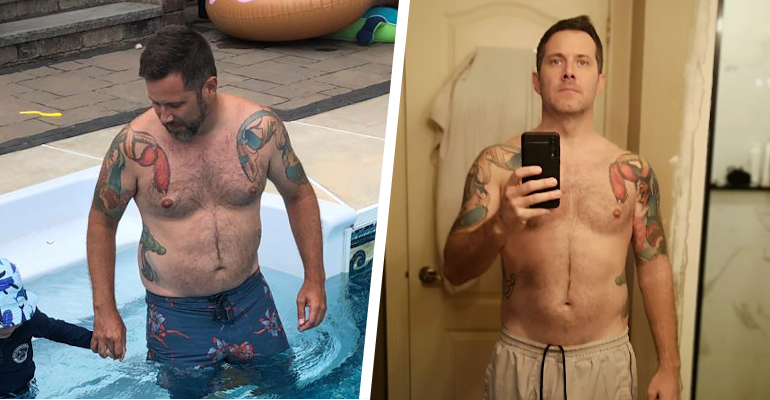

So let's be serious, 2020 was a completes S@#% show! (I think we can all agree that throwning down a little profanity is justified)

I won't spend much time on the negative, we've all experiened it and we've all chosen how much (or how little) we would "respect" the decisions made by our government. The last thing I'm going to say is... regardless of your option, if you couldn't follow some simple rules of staying in while people lost their lives and their jobs because of your **rights** then you should probably just click away now.

## Health & Fitness

Putting this first isn't meant to take away from how much Carson has accomplished in school, nor how much Sue has accomplished at work; it's just that 2020 has been a pretty solid year for me committing to my goals of getting in shape, and I'm pretty damned proud. In late 2019 I made a decision (after running out or breath carrying Carson upstairs) that I would commit to:

- Losing some weight
- Getting better cardio
- Getting healthier all around

which on December 31st seemed like a pretty sweet idea. On January 1st that plan got thrown out the window! And I'll be honest, the biggest problem was setting this goal to start on the day I was going to be the most hungover of all days of the year.

> Learn from my experience, if your resolution is to get in shape, diet, etc; set it up to start on Monday after new years day. Give yourself some time to roll into the change, get un-hungover and eat / drink all of crap you still have in your house.

### Choosing a Diet

This was probably the hardest decision to make. The reason being is that it's one of the hardest things to follow. You only ever hear about how people dieting **absolutely love the diet** and have **lost so much weight on \_\_\_\_**; well that's bullshit. I guess based on your goals it might not be, or if you have better self control than I do it might not be, but for me it was not fun. You've read about the diets (so I won't go into it here) but essentially I followed a pretty strict:

- No alcohol. I kept this up from Jan to May (birthday) with no exceptions. I love beer. It tastes glorious. So this was pretty hard (see below).
- Limited carbs. I didn't commit to Keto, it didn't seem like it was something I could maintain. But after googling around you'll see the [mediterranean diet](https://www.ruled.me/ketogenic-mediterranean-diet/) which was definitely something I could commit to. I took it a littler further in terms of bread and pasta as "allowed" but it was definitely easy to follow

### Actually Dieting

So dieting sucks. It just sucks. Well, maybe it just sucks when you're the only person in the house doing it; regardless, it sucks! If you're dead set on getting this done then the biggest key is fully understanding just how much it will suck. Some of the biggest obsticles to overcome while dieting were:

#### Dieting Alone

If you, like me, were the only one dieting in your house you're going to run into this issue. The good thing was that I cooked the majority of the meals in the house, the negative was that every so often there was a pizza, or muffins, or pasta that popped up. The biggest key here is that if you know it's coming then setup for making your most favorite dish ever. Unless you've got a stronger will than I, and can just not eat it.

#### Friends and Family Suck

Although in the later parts of 2020 this wasn't an issue, the first part of 2020 still had me going out and seeing friends and family. The biggest issue here is that you're meeting up with friends and family at bars, pubs, houses, etc. and in each case you'll hear things like:

- You don't need to be on a diet.
- Don't be a @#%@% just have one drink.
- Etc.

No matter what it is, you need to ignore it. Sometimes you need to take it a littler further and be rude. It's not fun, but if this is something you're committed to, you're going to have to deal with people that aren't committed to it, or think that you shouldn't be committed to it. **This is hands down the hardest part**

#### Documenting Results

Another one of the biggest issues I had was that I hate posting about myself. I feel like no one really cares, no one wants to see it, people will judge! But honestly, it's easier with support. You'll have way more people supporting you - and the ones not supporting you are just dilholes and should be ignored. So be proud of the work you put in, no matter how little or how much.

### Results Are Worth It

Once you've suffered, and failed, and suffered, and failed... you'll get to the point where it becomes easier. You've gotten used to eating the same thing. You've gotten used to forcing yourself to workout when you'd rather just watch tv. Your friends have event stopped pressuring you to have **just one drink** when you're hanging out. This might take a week, or a month, however long it takes just keep on pushing through cause it will happen.

From December to June I dropped from **205** to **169** which was 10lbs lower than my goal of **180**, so here's an obligatory shot!

### Expected Regression

Once my birthday hit, I started to loosen up the diet a little (while maintaining the workout schedule) and as expected I gained some weight back, although I maintained my size. I slowly started adding in:

- Beer
- Wine
- Some of my preferred carbs (chicken pot pie, some breaded chicken, etc.)

Although I continued to refrain from:

- Pasta
- Breads
- Most other sugar

and I'm currently sitting around **180**, and I'm thrilled about it!

## Sue & Carson

As proud as I am of myself... Sue and Carson have blown me out of the water this year!

### Sue

### Carson

As hard as Covid is for adults, it's got to be a complete nightmare for kids; they don't understand what's going on, they just know that people seem more worried and there are so many new rules to follow (that just don't make any sense to them).

## Employment

Nothing, with regard to employment, changed in 2020. The team at [Standardbred Canada](https://www.standardbredcanada.ca) continues to roll through our conversion of legacy software. There are some pretty interesting things coming down the pipe for 2021 (but this is a year in review) so they don't mean much here.

We've all been doing our best to keep things going forward with all the obsticles:

- Working from home
- Rotating office shifts
- Working from home
- C.E.R.B

which pretty much everyone has been dealing with; so no point stewing.

I'm looking forward to another year, finishing off the Gaitway project, and starting on more of our mobile and use centric projects.

## Side projects

I've been attempting to get more experience with **Javascript** and **Typescript** under my belt this year. I've always been open about my dislike of Javascript and other typeless languages - just a personal preference I guess - but I fully understand this is the way things work and that I've got to get on board. Typescript has definitely helped with that process, although I'm still finding some things hard to wrap my head around, it's going.

### My Personal Site (this guy)

My personal site is always going to be a work in progress as I'm continually playing around with new libraries, trying out new ways of doing things while reading `best practices` across React, Javascript and Gatsby.

### React Native Bluetooth Classic

While developing my companies mobile application, for tracking horses through microchips, I took an already well known library `react-native-blueooth-serial` and modified it; resolving a number of issues that had been open for a while, updated the IOS version for `External Accessory`, as well as refactoring it for a little consistency.

This last year I took the time to convert the library completely to Typescript. The process was pretty solid (in my opinion) and the current version is currently available as a release candiate `v1.60.0-rc5`. A number of people have been testing and providing feedback, and I think it's starting to get ready for full `v1.60.0`.

For more information check out [React Native Bluetooth Classic](https://www.kenjdavidson.com/react-native-bluetooth-classic).

### Git Golf Gps

I've been trying to become a contributor on the wonderful project [Smart Watch Golf Gps](https://smartwatchgolfgps.com/) to no avail. For that reason I've decided that I could probably just start on my own version, allowing me to:

- Get more experience with React
- Get some experience playing with Fitbit SDK and creating the watch app in a way that I'd prefer it
- Look into the Github API as a backing engine for the framework

Since it's free, and has a large user base, I figured that managing shared project files (JSON course definitions) would be a solid choice for developers who are also avid golfers.

Stay tuned...
