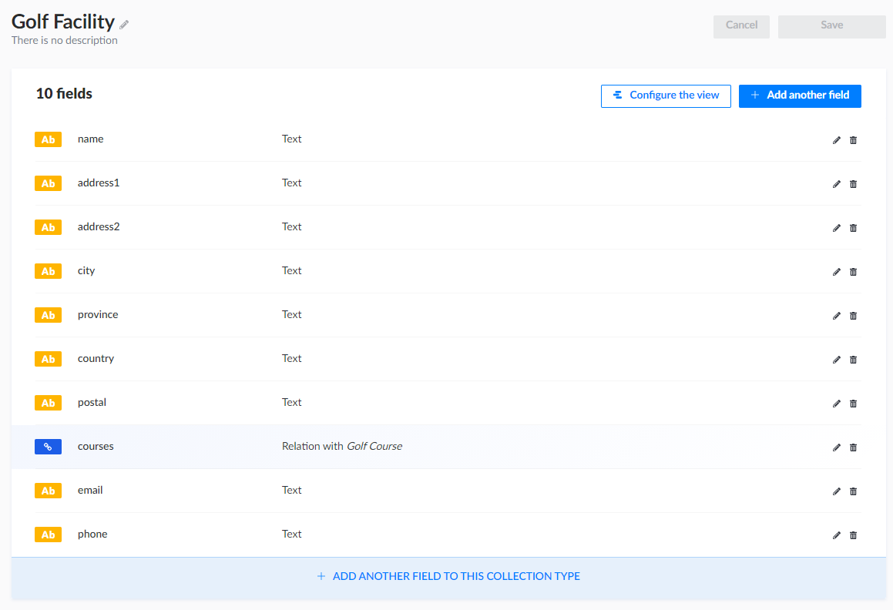
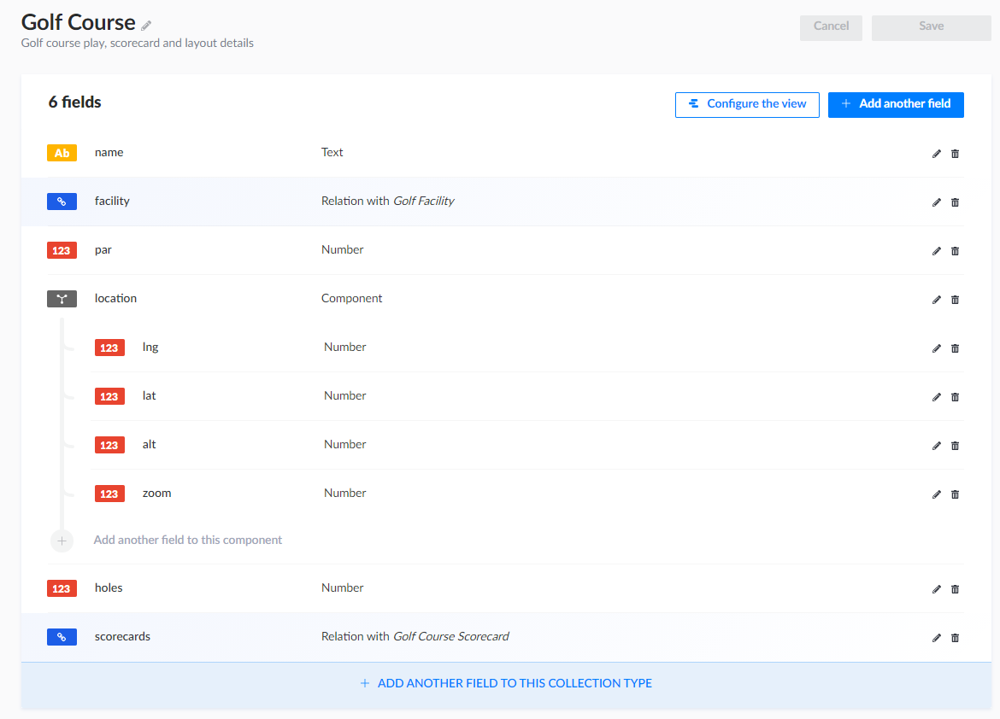
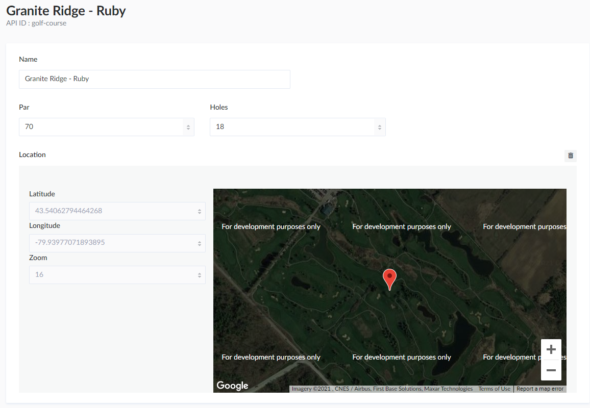

In the continuation of my attempt to learn/love Javascript I've spent a bunch of time creating a [React](https://reactjs.org/)/[Gatsby](https://www.gatsbyjs.com/) which I had planned to host on Github Pages.  It was going to be backed by a Github repository that allowed users to manage from their own account.  In playing around with this though, it's not possible for a user to OAuth login to Github without a live server (or proxy) which I wasn't planning on.

I decided to 180 the process and play around with the idea of:

- Continue to manage data through the Github API but require users to authenticate with a Github Access Token
- Writing my own backend from scratch
- Customize an established software suite/package to leverage what I needed

The first one I came across that seemed promising was [Strapi](https://strapi.io/).  Looking through the docs, comments, etc. there were definitely some pros and cons to this selection.  Taking a look at some of the hotter topics:

##### Pros

- Fully built and self managed CMS solution with Javascript
- As a CMS it provides customizable content
- It seems to have a powerful plugins system for back and front end customization
- A decent selection of documentation
- Self managed data (although also a negative, see below)

##### Cons

- The `Content Type Builder` seems to be pretty primative with regards to similar projects (specifically with regards to [Sanity](https://sanity.io)).  For example custom fields/types are not actually editable through the builder, which shouldn't be a huge issue, but could be.
- They standard queries look a little light - for example querying based on relation seems limited.  This is more an issue with ORM in general, so there should generally be ways to work around it.
- Limited number of real tutorials/examples.  Although a bunch of documentation and some tutorials - the majority are `hello-worlds` which are generally useless when it comes down to actually attempting to build something I find.
- Self managed deployment - since I'm no DevOps expert (and cheap) this is where more questions come into play.

## Let's Get Started

Getting started we need to get Strapi up and running.  The [installation guide](https://strapi.io/documentation/developer-docs/latest/setup-deployment-guides/installation.html) provides a wealth of information regarding a number of different installation methods.  For the purpose of playing around though, I chose to go the [docker route](https://strapi.io/documentation/developer-docs/latest/setup-deployment-guides/installation/docker.html) as it seemed the most condusive to deployment (future Ken's problem).

### Docker Compose

Following the instructions on the installation site a `docker-compose.yml` was created using standard `strapi/strapi` image.  After first attempting this there were two things:

1. Strapi was started but not actually built (there is a PR in order to ensure `strapi build` is added to the example).
2. It wasn't setup for local development, since the main goal I had was going to be doing both backend and frontend it required some tweaks.

> Note - I fully admit my Docker game is super weak.  Please feel free to provide any updates if you've come across this and see something off.

The following contains the required changes to get things going for development:

```yml
# docker-compose.dev.yml
version: '3'

services:
  strapi:
    container_name: caddieasy-strapi-dev
    image: strapi/strapi
    ports:
      - 1337:1337
      - 4000:4000
    volumes:
      - ./app:/srv/app
    command: 'strapi develop --watch-admin'
```

running `docker-compose -f docker-compose.dev.yml up` starts the environment with the following:

- Project installed and running out of `./app`
- Database running `sqlite`
- `https://localhost:1337` open for server development
- `https://localhost:4000` open for admin development (slows down if not actually doing admin development, but for the purpose of playing it seems fine)

Once you connect you'll be asked to create your admin user and login for the first time...

## Start Modelling in Strapi

I wanted to pull together a couple already available features [smart watch golf gps](https://gallery.fitbit.com/en-ca/details/859975b5-8dcd-4d98-ab1c-1592f5f3c878) which apparently now costs $5 bucks to use, [Game Golf](https://gallery.fitbit.com/en-ca/details/59ea369e-e838-4645-aebe-349d0c8e0e0f) which apparently you need an account for but I can't actually create one.

I wanted to add in a few features which these don't have and that neither have been interested in me contributing.

### Manage Facilities and Courses

The first requirement was to obviously be able to maintain a listing of the Courses, which can be abstracted into a layer for Facilities.  For example, my home course of [Granite Ridge Golf Course]() has two courses: Ruby and Cobalt.  Although it would be easy enough to add contact information to the Course, splitting out Facility allows the management of other elements: Address, Pro, Menu (for example) down the road.

#### Facility

Fire up the `Content Type Builder` and start adding data elements related to a golf facility.  Keeping this at a super high level for now:

- Name
- Address
- Address2
- City
- Province 
- Country
- Email
- Phone



Save this and you'll see that Strapi is restarting.  This is intersting, mainly because Strapi (like other CMS which I wasn't aware of) keep the schemas within files in the project, and not managed directly against the database.

#### Course

Now we'll add the basics of a course - obviously this could get crazy (and probably will) but for the time being we'll try to set it up as simply as possible:

- Name
- Holes
- Par
- Facility (many to one reference)
- Location (lng, lat, alt, zoom)



One of the cool things, when you add the `Relation` it's automatically included on the **Golf Facility** content type as well.

##### GeoPoint Component

In order to implement the `location` field I needed to add a Component that will allow the management of data.  After a few searches and review of the currently available ideas (as none of them are in core or provided easily) it looks like the consensus is to use GeoJSON along with a compatible database vendor (Mongo, PostGIS, etc).  Being honest with myself, I neither have the experience with Mongo nor the time/energy to get PostGIS installed looking at it's documentation.  

Because I'm basic, I want a table with actual fields for `latitude`, `longtitude`, `altitude`, and `zoom`.  I'm sure this will blow up later, but for the time being I createda  little component called `geo-point`:

```json filename:components/map/geo-point.json
{
  "collectionName": "components_map_geo-point",
  "info": {
    "name": "geo-point",
    "icon": "map-marked-alt",
    "description": ""
  },
  "options": {
    "privateAttributes": [
      "id"
    ]
  },
  "attributes": {
    "lng": {
      "type": "float",
      "required": true
    },
    "lat": {
      "type": "float",
      "required": true
    },
    "alt": {
      "type": "float"
    },
    "zoom": {
      "type": "integer"
    }
  }
}
```

> Note - lng, lat and alt come from how Google Maps uses `LngLat` and `LngLatLiteral` just to make life simple

### Adding Courses

Now that we have a super basic structure, we can start adding in some of the data to let us do some basic testing - testing that will determine whether this solution is viable, or whether or not we need to hit the drawing board again (we'll get to the specific a little later).  I've gone ahead and added the two courses available at my home facility:

```
Granite Ridge Golf Course
  name: Granite Ridge Golf Club
  address: Dublin Line
  city: Milton
  province: ON
  courses:
    - name: Granite Ridge Ruby
      holes: Eighteen
    - name: Granite Ridge Cobalt
      holes: Eighteen
```

### Querying Data

Now that we've got our basics setup, lets give it a go on [Postman](https://www.postman.com/).

> Note to self, don't forget the permissions for public users!!

#### Golf Facilities

We're given the external address required to query content while editing - just using the url pointing at the pluralized named of the content type, we get back all our available Golf Facilities:

```json filename:http://localhost:1337/golf-courses
[
    {
        "id": 1,
        "name": "Granite Ridge Golf Club",
        "address": "Dublin Line",
        "city": "Milton",
        "province": "Ontario",
        "published_at": "2021-03-23T18:08:36.029Z",
        "created_at": "2021-03-23T18:08:02.852Z",
        "updated_at": "2021-03-23T18:08:36.077Z",
        "location": {
            "id": 1,
            "lng": -79.94186611445596,
            "lat": 43.54068791918545,
            "alt": null
        },
        "golf_courses": [
            {
                "id": 1,
                "name": "Granite Ridge Ruby",
                "golf_facility": 1,
                "holes": "Eighteen",
                "published_at": "2021-03-23T18:08:39.421Z",
                "created_at": "2021-03-23T18:08:23.063Z",
                "updated_at": "2021-03-23T18:08:39.471Z"
            },
            {
                "id": 2,
                "name": "Granite Ridge Cobalt",
                "golf_facility": 1,
                "holes": "Eighteen",
                "published_at": "2021-03-23T18:08:56.496Z",
                "created_at": "2021-03-23T18:08:55.389Z",
                "updated_at": "2021-03-23T18:08:56.539Z"
            }
        ]
    }
]
```

##### Location Id
One thing to note here is that `location.id` is probably not required; as this is a component and not actually searchable on it's own there is no point in displaying it to the world.

The default controller is doing some sanitation to remove private fields, in order to take advantage of this we need to update the file:

```json filename:./components/location.json
  "options": {
    "privateAttributes": [
      "id", 
      "created_at", 
      "created_by", 
      "updated_at", 
      "updated_by", 
      "published_at", 
      "published_by"
    ]
  },
```

Which will clean out the id field.  The same is added for `created_at`, `updated_at` and `published_at` for both facilities and courses, although I don't think it really matters much, just not point in upping the data transfer when they aren't actually needed.

##### Default Relation Names

Another thing, when creating the relationships I wasn't careful to rename them, so they were given names based on their content type `golf_facility` and `golf_courses` instead of just `facility` and `courses` (respectively).   After making the change, I needed to re-apply the relationships (which would have been super annoying if it wasn't caught sooner!

### Filtering the Data

Now that we know our data is coming through, we need to figure out if we have access to all the filters/queries that will most likely be needed by clients.  For this we can go through some of the examples provided at [API Parameters](https://strapi.io/documentation/developer-docs/latest/developer-resources/content-api/content-api.html#api-parameters) let's ensure that some of the most likely search cases are available:

1. Search by name: `http://localhost:1337/golf-courses?name=Granite Ridge Golf Course` is available and somewhat likely.

2. Search by name and city `http://localhost:1337/golf-courses?name_containss=Granite&city_containss=milton` is probably more likely to be used, as there could be multiple courses with the same name across the globe.

> Notice that the use of `containss` instead of `=` or `contains` to manage case-insensitivity.

3. Search courses that are 18 holes `http://localhost:1337/golf-courses?holes=18` to let us search through to the relation data. 

> The documentation states that this could cause performance issues.  None were noticed with two courses, but obviously this is something that would need to be monitored as data grows.

3. Filter by Location `http://localhost:1337/golf-courses?location.lng=-79.94186611445596` is where we run into our first problem.  For the purpose of this article (I'll act super surprised) but from spending some times reading about some of Strapi's short comings this was a major one.  Although this is a basic query attempting to match the `longitude` of our facility, without it working it means that our actual query looking for courses within a GPS area are not going to work.

Since this is one of the absolute requirements for working with Golf data, it's something that we either need to resolve or work around.  Let's take a look at what both of those would require:

#### Work Arounds

The easiest way to get around this issue, is by removing the `location` abstraction and putting `lng` and `lat` directly on the `Golf Facility` type.  Before we actually make changes to our structure (mainly because this is not optimal) let's look at the pros and cons:

**Pros**

- It should work out of the box with our queries, since we have access to `eq`, `gt` and `lt` which are required for box lookups.

**Cons**

Our cons aren't apparent until we look well ahead into the application, but we still need to be aware they exist:

- We're going to need to create a custom UI for the location entry, allowing the user to pick a point on map.  When using Components we can set the input for the full component, so we'd have a single map that sets `lng`, `lat`, and `alt` (if needed) in a single shot.  If we were to split these fields out into the Facility type, then we would need to manage them separately (but ensure they are together).
  - Clicking on either `lng` or `lat` will pop up the same interface, and update each other - not optimal but not terrible
  - Keep the current `location` component but add two private fields that will update whenever `location` updates - same level of not optimal but not terrible

So our choices are definitely workable, I'd probably lean towards the private `lng`/`lat` fields that are searchable, but still fall back to the transmission of `location` to the end user.  It would still be better if we could get searching working to keep the data duplication to a minimum.

## Customizing the API 

One of the pros to Strapi is that it provides a large number of customizations that should allow us to get this done.  It's only (or should be) a matter of getting through the documentation and determining how to do it.  If we look at our requirements, we might have a good idea:

- Users should be able to send their location (or a location)
- ...do stuff...
- Users get back a list of Courses within a raduis of that location

Pretty simple right!!

Ok, so let's start:

### Adding the Endpoint

User sends in a query `http://localhost:1337/golf-courses?lng=${lng}&lat=${lat}&r=${radius}`

So we know that this is going to use the standard controller, which we don't want to override.  It makes sense to add a custom endpoint to allow doing this, `http://localhost:1337/golf-courses/nearby?lng=${lng}&lat=${lat}&r=${radius}` seems good.

```json filename:http://localhost:1337/golf-courses/nearby?lng=-79.94186611445596&lat=43.54068791918545&r=50

{
    "statusCode": 400,
    "error": "Bad Request",
    "message": "Your filters contain a field 'lng' that doesn't appear on your model definition nor it's relations"
}
```

So let's add the endpoint - we open up and edit.  It's important that we put the new entry above the `/golf-courses/:id` entry, or else the `:id` will suck up our request with `:id=nearby` as we are seeing in the above request:

```json
    {
      "method": "GET",
      "path": "/golf-courses/nearby",
      "handler": "golf-courses.nearby",
      "config": {
        "policies": []
      }
    },
    {
      "method": "GET",
      "path": "/golf-courses/:id",
      "handler": "golf-courses.findOne",
      "config": {
        "policies": []
      }
    },
```

Now we need to add in a little love for our controller so that we can manage the request, let's open up the pre-built `./golf-courses/controllers/golf-courses.js` and apply the function:

```js filename=controllers/golf-courses.js
module.exports = {
  findNearby: async (ctx) => {
    const { query, request, response } = ctx;
    const errors = [];

    if (!query.lng || isNaN(query.lng)) {
      errors.push(`lng is required and must be a valid number`);
    }
    if (!query.lat || isNaN(query.lat)) {
      errors.push(`lat is required and must be a valid number`);
    }
    if (query.r && isNaN(query.r)) {
      errors.push(`query 'r' must be a valid number`);
    }

    if (errors.length > 0) {
      ctx.throw(400, `Invalid query parameters: ${errors}`);
    }

    const entities = await strapi.services['golf-course'].findNearby(
      new LatLng(Number.parseFloat(query.lat), Number.parseFloat(query.lng)),
      query.r && Number.parseInt(query.r)
    );
    return entities.map((e) =>
      sanitizeEntity(e, { model: strapi.models['golf-course'] })
    );
  },
};
```

### Adding the Service

Now we work on the golf facility service.  The service is going to have a little more to it, being responsible for:

- Calculating the GPS box in which we look for courses
- Querying the courses within the box, for this we need to reach into [Knex]() in order to return a list of facility ids.
- Use the provided course ids to return the `golf-courses` model data including courses.

First thing first we need to make life easy, let's add `spherical-geometry-js` to gain access to some friendly GPS utility functions:

```shell
# If you're on windows, make sure you run this on the Image, if not you'll mess up the Sharp library build
yarn add spherical-geometry-js -S
```

Now we can start applying what we need to the service:

```js filename=services/golf-courses.js
module.exports = {
  findNearby: async (latLng, r = 10) => {
    const [nw, se] = getBoundingBox(latLng, r);

    const knex = strapi.connections.default;
    const courseIds = await knex({ cml: `components_map_geo-point` })
      .innerJoin({ gcc: `golf_courses_components` }, function () {
        this.on(function () {
          this.on(`gcc.component_id`, '=', `cml.id`);
          this.andOn(
            `gcc.component_type`,
            '=',
            knex.raw('?', ['components_map_geo-point'])
          );
        });
      })
      .whereBetween(`cml.lat`, [se.lat(), nw.lat()])
      .whereBetween(`cml.lng`, [nw.lng(), se.lng()])
      .select(`gcc.golf_course_id`);

    return strapi.query('golf-course').find({
      id_in: courseIds.reduce((acc, cur) => cur.golf_course_id, []),
    });
  },
};
```

Where we're doing:

- A lookup of the components `map.geo-point` within the bounds that were calculated
- Reducing the Ids found and using them to search using the built in Strapi query

which (with this simple example) results in the return of our only course:

```json
[
    {
        "id": 1,
        "name": "Granite Ridge - Ruby",
        "facility": {
            "id": 1,
            "name": "Granite Ridge Golf Club",
            "address1": null,
            "address2": null,
            "city": "Milton",
            "province": "ON",
            "country": "CAN",
            "postal": null,
            "email": null,
            "phone": null
        },
        "par": 70,
        "holes": 18,
        "location": {
            "lng": -79.93977071893895,
            "lat": 43.54062794464268,
            "alt": null,
            "zoom": 16
        }       
    }
]
```

## Data Input/Management

Up until this point, we're in a pretty solid spot with regards to the querying of the data.  I've got my structures and my queries lined up, which all seem to be working exactly as I want them. But now there is one big problem, after reviewing the code it looks like I cannot assign a React Component (field component) to a whole Component, for example, I cannot provide a MAP and have it update the whole `location` field on the `golf-courses`.  Currently there are only field level customizations, which is sad, and means we need to:

1. Contribute to the `content-manager` plugin so that full Components can be customized as a whole.
2. Extend the `content-manager` plugin supplying my own Component when it comes across the type `geo-point`
3. Revert back to the original idea of `lngLat`, `lat` (hidden) and `lon` (hidden) fields providing the custom input for `lngLat` and generating the other fields from it.  I'm curious if I can keep the Location component, and update it from the `lnglat` field.

Since I really don't want to change the data structure at this point, since if this was using it's own custom UI it would be easy enough to supply the content in the right format to the Strapi backend, it leaves us with option 2 (obviously 1 and 2 are practically the same, 2 is just local)

### Extending Content Manager

There is a bunch of documentation going over how to [extend plugins](https://strapi.io/documentation/developer-docs/latest/development/admin-customization.html#admin-extension).  Essentially we just:

- Create a new folder `extensions/admin/src`
- Export the original file to the exact location within the new folder
- Edit to our hearts desire

During the build process, the extensions folder is copied overtop of the Strapi folder, making this possible.  If this works, we can look at porting it back and contributing to the main project.  To me it seems like a pretty common or usable use case, but who knows.

#### Overriding the Content Manager

Great!! We know that we can override the Content Manager plugin, but how do we go about doing this?  We need to dive into the code and try to understand how the Content Manager is actually building the screens.

...couple hours reading code...

At a high level the major players in this process are:

##### FieldsComponent

The `FieldsComponent` is the primary component used for rendering (that I can find).  It's responsible for determining what to display for the data being edited, the options are:

- **NotAllowedInput** which is shown when the field cannot be displayed or viewed based on security
- **ComponentInitializer** which is displayed for _NON REPEATABLE_ components.  It allows the user to press the (+) button to add an empty component value
- **NonRepeatableComponent** which is displayed for _NON REPEATABLE_ components (great naming).
- **RepeatableComponent** which is displayed for _REPEATABLE_ components (great naming again).

##### NonRepeatableComponent

Taking a look in `NonRepeatableComponent` it does one of two primary things:

- It recursively displays another `FieldComponent` if required
- It loops through the content type fields and adds the appropriate `Inputs`

##### RepeatableComponent

`RepeatableComponent` does pretty much the same thing, but adds an intermediate step of `DraggedItem`.

##### DraggedItem

This does something extremely similar to what we've seen from `NonRepeatableComponent`:

- It recursively displays another `FieldComponent` if required
- It loops through the content type fields and adds the appropriate `Inputs`

This makes sense, since inside DraggedItem you would have a `NonRepeatableComponent`.

#### Time to Play Around

Knowing what we know now, it seems like the best things to do are:

- Update `DraggedItem` to use `NonRepeatableComponent` instead of having duplicated that code
- Update `NonRepeatableComponent` to use the `componentApi` and choose want to display

##### Update DraggedItem

First thing first, we need to take all the common logic in `DraggedItem` that is similar to `NonRepeatingComponent` and replace it.  After doing so I've got something that looks like this:

```js filename=DraggedItem/index.js
...
        {!isDragging && (
          <FormWrapper
            hasErrors={hasErrors}
            isOpen={isOpen}
            isReadOnly={isReadOnly}
          >
            {showForm && (
              <NonRepeatableComponent
                componentUid={componentUid}
                name={componentFieldName}
                onBlur={hasErrors ? checkFormErrors : null}
              />
            )}
          </FormWrapper>
        )}
...
```

The only thing that was missing `NonRepeatableComponent` was the `onBlur` function being passed to `Inputs`. 

##### Update NonRepeatableComponent

With regards to the `NonRepeatbleComponent` there are only a few things we need to do:

- Pull in the `componentApi`

```js
  const {
    strapi: { componentApi },
  } = useStrapi();
```

- Pull in the `EditViewDataManagerContext` details.  This is the heart and soul of the Content Manager - it builds and makes available all the important information, things like: `onChange`, `modifiedData`, `initialData`, and much much more.  It probably wasn't meant to be used as a whole like this, but without any form of standards (the JS way, hahah) I'll just use the whole object.

```js
  const dataManager = useDataManager();
```

- Determine whether we have a customized component

```js
  const component = componentApi.getComponent(componentUid);
  const Component = component && component.Component;
```

- Fill the `NonRepeatableWrapper` with either the custom component or the standard fields

```js
      {Component && (
        <Component
          componentUid={componentUid}
          componentFieldName={componentFieldName}
          dataManager={dataManager}
        />
      )}
      {!Component &&
        fields.map((fieldRow, key) => {
```

At this point, since there are no custom fields everything should be working exactly as it was before:

- Non repeatable components working... CHECK
- Repeatable components working... CHECK

You can take my word or test it out yourself.

### Creating the Caddieasy Plugin

We want to extend the Plugin and FieldApi functionality to work with Components, since a field type, it makes sense that we may want to replace the WHOLE component UI with our own field implementation.  For that we need to take a look at the [field api documentation](https://strapi.io/documentation/developer-docs/latest/guides/registering-a-field-in-admin.html#creating-a-new-field-in-the-administration-panel).  

After a little bit of review, there looks like there is also a `ComponentApi` which is only being used in the `MediaLib` component within the `wysiwyg` field.  This seems like a pretty good place to hook into. 

- I have a component `geo-point`
- I will have a React Component

#### Create a new Plugin

Create the plugin to house our react Component and functionality, once complete we'll move the Strapi component definition here:

```shell
# On Windows :(
node .\node_modules\strapi\bin\strapi.js generate:plugin geo-point
```

This provides all (albeit overkill) of the files required for a plugin.  

#### Create InputGeoPoint component

If we jump into the `InputGeoPoint`:

```js filename=GeoPoint.js
const InputGeoPoint = ({ componentUid, componentFieldName, dataManager }) => {
  const [mapRef, setMapRef] = useState(); // google.maps.Map
  const { formatMessage } = useIntl();
  const { modifiedData, onChange } = dataManager;
  const componentValue = get(modifiedData, componentFieldName, null);

  const onClick = ({ latLng }) => {
    onChange({
      target: {
        name: 'location',
        value: {
          ...componentValue,
          lat: latLng && latLng.lat(),
          lng: latLng && latLng.lng(),
          zoom: mapRef && mapRef.zoom,
        },
      },
    });
  };

  useEffect(() => {
    if (mapRef && componentValue.lat && componentValue.lng) {
      mapRef.setCenter(componentValue);
      mapRef.setZoom(componentValue.zoom || 11);
    }
  });

  return (
    <Wrapper>
      <DisplayWrapper>
        <InputNumberWithErrors
          name="latDisplay"
          label={formatMessage({ id: `${pluginId}.mapping.latitude` })}
          value={componentValue.lat}
          disabled={true}
          customBootstrapClass="col-md-12"
        />
        <InputNumberWithErrors
          name="lngDisplay"
          label={formatMessage({ id: `${pluginId}.mapping.longitude` })}
          value={componentValue.lng}
          disabled={true}
          customBootstrapClass="col-md-12"
        />
        <InputNumberWithErrors
          name="zoomDisplay"
          label={formatMessage({ id: `${pluginId}.mapping.zoom` })}
          value={componentValue.zoom}
          disabled={true}
          customBootstrapClass="col-md-12"
        />
      </DisplayWrapper>
      <MapWrapper>
        <GoogleMapView
          onLoad={(map) => setMapRef(map)}
          onUnmount={() => setMapRef(undefined)}
          onClick={(event) => onClick(event)}
        >
          {componentValue.lat && componentValue.lng && (
            <Marker position={componentValue} />
          )}
        </GoogleMapView>
      </MapWrapper>
    </Wrapper>
  );
};
```

we see that:

- I'm still displaying the `lng`, `lat`, `alt`, and `zoom` values, although they are disabled.
- I'm displaying a `GoogleMap` component that accepts a click and updates the full location component

#### Installing InputGeoPoint Component

Finally we need to make sure it gets installed with the plugin, to do this we have to update the plugin `index.js` file:

```js filename=index.js
strapi.registerComponent({ name: 'map.geo-point', Component: InputGeoPoint });

return strapi.registerPlugin(plugin);
```

which should now result in our Course location being editable via a map:



