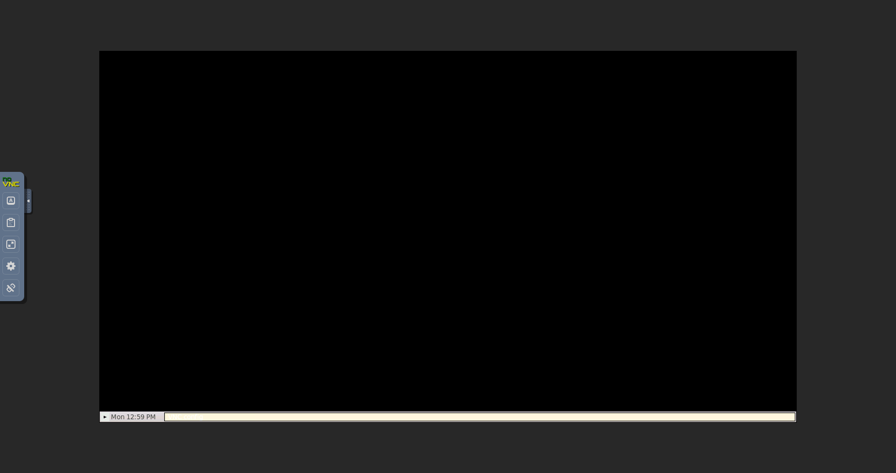
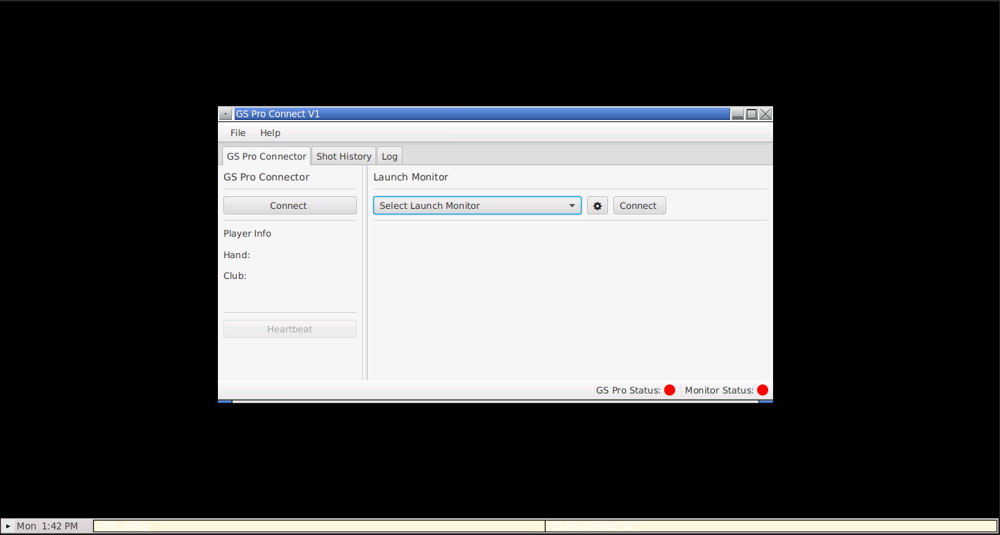

Time to throw my hat into the ring with a **JavaFX and Spring Boot** article.  This information exists elsewhere, but I've accumulated and added what I've learned in the hopes:

- that I'll be able to remember it going forward
- learn a little about spring boot
- help someone with the same pains

> As always, feel free to add some comments or push me in the right direction if you've come across this and see that I'm going in the completely wrong way.

## Project Details

If it's not apparent, I love golf.  Which means in the winter I love virtual golf.  The last winter I've been playing [E6 Connect](https://e6golf.com/) using the [SLX Micro Simulator](https://www.swinglogic.us/slx) and it's gotten me by.  Although now that the primary game that I've been playing has disallowed the SLX Micro Sim, I figured I'd see if I could give [GS Pro](https://gsprogolf.com/) a shot; it seems to have substantially better reviews in terms of graphics and game play, just not internal simulator support.

It does offer the [GS Pro Connect API](https://gsprogolf.com/GSProConnectV1.html) which already have some plugins available for different monitors.  Not that I have (nor maybe will ever have) the SLX Micro library, but here's dreaming.  This project should be a fully working, pluginable, desktop application that will provide the UI and GS Pro Connect functionality to any willing to create a library plugin.

The source for this can be found at [https://github.com/kenjdavidson/gspro-connect](https://github.com/kenjdavidson/gspro-connect).

## Development Environment

### Initialize the Project

The project is initialized pretty quickly:

1. Open up Visual Studio Code
2. `Ctrl-P` to open up the palette and choose `Remote Container: Add Development Container Configuration Files`
3. Configure the newly generated `.devcontainer` with the following Java related extensions

```
	"extensions": [
		"vscjava.vscode-java-pack",
		"Pivotal.vscode-boot-dev-pack",
		"GabrielBB.vscode-lombok",
		"redhat.vscode-xml"
	],
```

4. Startup the devcontainer with `Ctrl-P` > `Remote Containers: Rebuild and Run Container`.  This is where I started development on the API side of things (non-spring, non-fx).

> Just a note - Java and VSCode still still seem to have some issues, specifically regarding the Java Language Server and other Java Language plugins.  Particularly when the devcontainer is first built.

I've found a couple things that help:

- Adding `mvn clean install -DskipTests` to the container post build command.  
- When rebuilding the container, you may need to restart the Java language service after `mvn install` runs.

#### Project 

The project consists of a maven parent module `gspro-connector` and a number of sub modules:

- `gspro-api` which contains the api data and connection functionality
- `gspro-client` (deprecated) wrapping the api connection 
- `gspro-app` which is the JavaFX/Spring Boot application.  The application contains a basic form based launch monitor which can be used if no other plugin(s) are provided.
- `gspro-api-garmin-r10` which is a sample plugin, the Python and Javascript version were first developed by [Travis Lang](https://github.com/travislang/gspro-garmin-connect-v2) and converted to Java to showcase how a plugin is used.

### Desktop in Devcontainer

Now that the API is pretty good, it's time to start on the interface portion.  I know what you're thinking, this could have been a web app (desktop apps are uncool now); but realistically there is just much less to do:

- The code is self contained in Java, no HTML or JavaScript to need to worry about.
- The communication code doesn't need to be added, no Websockets, etc to fool around with.
- For the purpose of this it just made sense to take out the extra layer

But the main issue is **Devcontainers have no desktop**!!!

But thanks to a number of people smarter than I, this is manageable using the the Visual Studio Code feature [desktop-lite](https://github.com/microsoft/vscode-dev-containers/blob/main/script-library/docs/desktop-lite.md).  There are a number of great tutorials on how to get this working, so I'll just provide the short form here:

1. Configure your `.devcontainer` with the required feature, **desktop-lite**, which as described 

> Adds a lightweight Fluxbox based desktop to the container that can be accessed using a VNC viewer or the web. GUI-based commands executed from the built-in VS code terminal will open on the desktop automatically.

which is what we want:

```
	"features": {
		// Install desktop-lite (Fluxbox) on devcontainer
		// When starting GsProConnectApplicationBoot application loads into desktop
		// https://lucasjellema.medium.com/run-and-access-gui-inside-vs-code-devcontainers-b572643d0d2a		
		"desktop-lite": {
			"password": "vscode",
			"webPort": 6080,
			"vncPort": 5901
		}
	},
```

2. Add the appropriate port forwarding.  Here there are two options:

- Web 
- VNC

Both are configured in this case, but I generally just use the web desktop:

```
	// Use 'forwardPorts' to make a list of ports inside the container available locally.
	"forwardPorts": [
		6080,	// desktop-lite web
		5901,	// desktop-lite vnc
	],	
```

Once the devcontainer is started, you'll be able to login to _http://localhost:6080_ with the password you provided (vscode in my case).  Now when you start up your JavaFX application it will be run in the context of the VNC desktop.



## JavaFX with Spring Boot

The connect application provides a standardized `GS Pro Connector` interface and the ability to choose from a number of installed `LaunchMonitor`(s) using the `LaunchMonitorProvider` interface.  By default there is only the `FormLaunchMonitor` installed, but these are easy to implement and add to the application by placing the compiled JAR in the class path.



### Two Applications/One Stone

One of the major issues run into across the web is getting the Spring Boot `Application` to play nicely with the JavaFX `Application`.  There are a number of great tutorials on this:

Following a combination of these tutorials the resulting `Application` classes look like this:

**Spring Boot**
```

```

**JavaFX**

### Controllers (FXML)

The FXML controllers are implemented through the `#setControllerFactory` providing the `applicationContext::getBean` method.  Controllers are setup as `prototype` scope, although this causes more issues down stream seeing as the application only has 1 instance of each, things would have been easier if left as `singleton`.  Each Controller has it's applicable service injected appropriately.

> Stolen from another project the `ViewManager` provides the direct management of loading FXML views.

```
public <T> T load(String view, Stage stage) throws IOException {
  String resource = validateViewPath(view);
  FXMLLoader loader = new FXMLLoader(getClass().getResource(resource), ResourceBundle.getBundle("i18n"));
        
  loader.setControllerFactory(applicationContext::getBean);

  // Need to find a way to make an fxml scope so that controller and builder will return the same
  // controller from the context, instead of needing the controller to be a singleton (bad) or 
  // having two different instances of the same class (also bad); since all examples for use of
  // fx:root use #setRoot(this); #setController(this); when performing the load.
  //loader.setBuilderFactory(builderFactory);
        
  T parent = loader.load();  

  if (loader.getController() instanceof StageAware) {
    ((StageAware)loader.getController()).setStage(stage);
  }

  return parent;
}
```

> This could have been more easily done with [FXWeaver](https://github.com/rgielen/javafx-weaver), which is on the todo list for implementation.  It still doesn't help resolve the `fx:root` issue though.

### Services


### Issues

One of the main issues that I ran into while getting this project going was the inability to use `fx:root` to build the FXML components.  There are a few ways around this that I found online, while JavaFX allows you to set the `FXMLLoader#setControlllerFactory` and `FXMLLoader#setBuilderFactory` to the `context::getBean` this will result in two separate version of the class (ie. Not the same instance of Controller being the root).  This can be worked around by using `singleton` scope for your highest level components (application scene, etc) but that also has limitations (only a single window available, which might work for the majority of applications).

The better way to get around this is only using `fx:root` for your reusable components, which shouldn't need access to the Spring context anyhow.

## Web App / Running as Service

The cool thing about backing JavaFX with Spring Boot is that if you'd like to run the application as a service, you have the option of quickly adding some Web Controllers and modifying the Spring Boot startup so that instead of running the JavaFX `Application` it runs the Web `Application`.  

### Updating the Spring Boot Application

### Starting the Application in Service Mode
